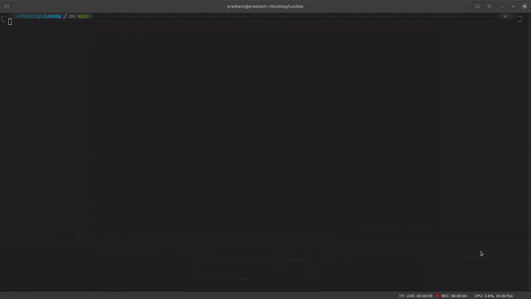
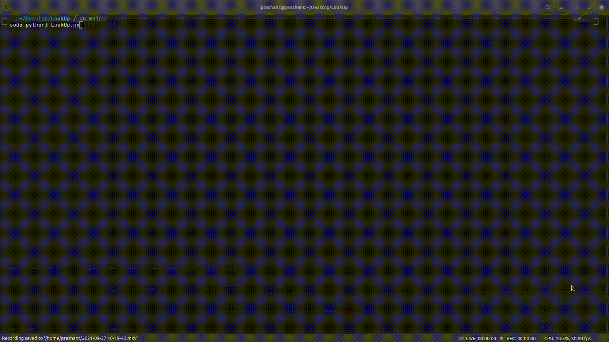
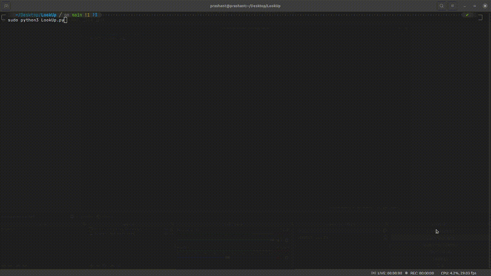

# LookUp

LookUp is used for newtork analysis. It can discover the host connected at a newtork. It can also scan the ports as well as packet sniffing. It uses python3 and scapy which is packet manipulation tool.    


## Installation

Install LookUp with terminal

```bash
  git clone https://github.com/softwarica-github/st4061cem-cw-prashantstha17
```
Run LookUp
```bash
  cd LookUp
  pip install -r requirements.txt
  python LookUp.py  
```

## Tools Used

The tools I have used for this project are as shown below:

- [Pycharm](https://www.jetbrains.com/pycharm/download/) as an IDE.
- [Scapy](https://scapy.net/download/) for packet manupulation.
- [Termcolor](https://pypi.org/project/termcolor/#files) for printing color text in terminal.
- [Npcap](https://nmap.org/download.html) for capturing packets.

## Demo

**Host Discovery**



**Port Scanner**


**Sniffer**

  
<br>
<br>

# Links

The links you can go through:

- Repository: https://github.com/softwarica-github/st4061cem-cw-prashantstha17
- Youtube video: https://www.youtube.com/watch?v=blurn-pgdmg
- A-packets: https://apackets.com/


<br>
<br>

### Prashant Shrestha
##### Student ID: 210160
##### Batch: 30 ETH
##### Email-ID : prashant.stha246810@gmail.com


<p align="center"><b><u><i> Thank you!!. Stars are appreciated. </i></u></b><p>
